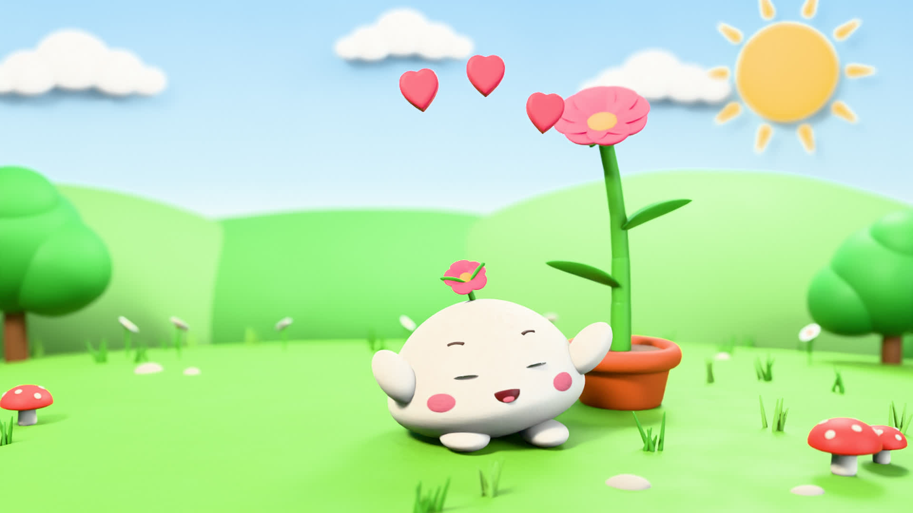
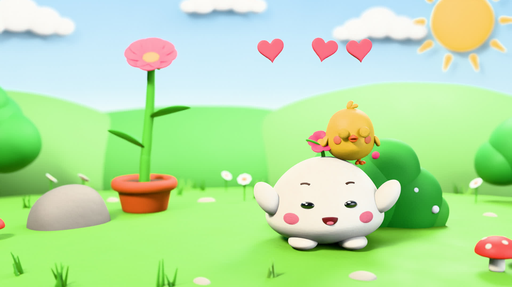
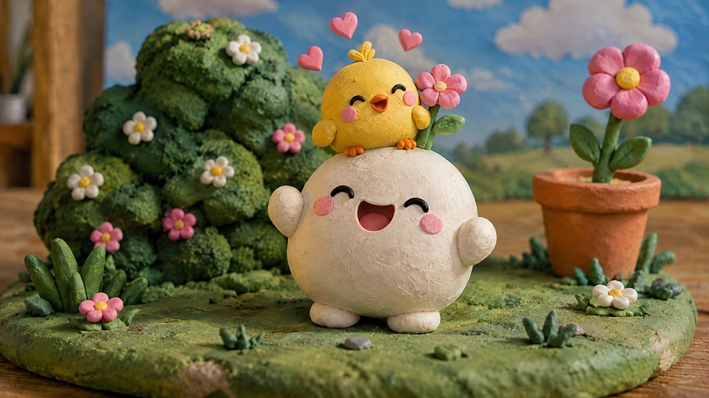

# 떡이 클레이 애니메이션

말랑한 떡 캐릭터 **떡이**가 나오는 15초짜리 클레이(스톱모션) 애니메이션 모음.
1·2화는 Blender 파이썬 스크립트와 numpy로 만들었고(2화의 삐약이만 트리포 3D 모델), 2화는 실제 점토 인형을
찍은 듯한 **AI 실사 클레이 버전**도 있다. 화면에 글자는 나오지 않는다.

| 1화 「새싹」 | 2화 「까꿍! 숨바꼭질」 | 2화 실사 클레이 버전 (AI) |
|---|---|---|
|  |  |  |
| ▶ [`sprout.mp4`](sprout.mp4) | ▶ [`peekaboo.mp4`](peekaboo.mp4) | ▶ [`peekaboo_ai.mp4`](peekaboo_ai.mp4) |

(세 영상 모두 1920×1080, 24fps, 15초, 사운드 포함)

## 1화 「새싹」

1. 떡이가 물뿌리개를 들고 깡총깡총 화분 앞으로 와서 물을 준다.
2. 화분을 빤히 들여다보며 기다리지만… 아무 일도 없다. 고개를 갸웃. **?**
3. 한숨을 푹 쉬고 시무룩하게 돌아서 걸어간다. *(빠-바-바-밤…)*
4. 그 순간, 등 뒤에서 새싹이 쑥쑥 자라더니 **뽕!** 하고 꽃이 핀다.
5. 깜짝 놀라 돌아본 떡이 **!** — 만세 점프!
6. 꽃과 서로 꾸벅 인사를 나누자, 떡이 머리 위 새싹에도 작은 꽃이 핀다.

기다릴 땐 안 오다가 포기하고 돌아선 순간 쑥 자라는 — 말 그대로 *떡*이의 새싹이 떡상하는 이야기.

## 2화 「까꿍! 숨바꼭질」

1. 새 친구 **삐약이**가 뒤돌아서 하나, 둘, 셋… 숫자를 센다.
2. 그 사이 떡이는 살금살금 덤불 뒤에 숨는다. 그런데 머리 위 꽃(1화에서 핀 그 꽃!)이 덤불 위로 쏙.
3. 삐약이가 바위 뒤, 화분 뒤를 찾아보는 동안 덤불 위 꽃은 삐약이를 졸졸 따라 고개를 돌리고, 킥킥 떤다.
4. 꽃을 발견한 삐약이. 꽃이 스르르 덤불 속으로 가라앉는다. 삐약이는 관객에게 '다 알아' 하는 눈짓.
5. 살금살금 덤불 앞으로 다가가면… **까꿍!** 떡이가 덤불을 훌쩍 뛰어넘는다. 둘 다 깜짝!
6. 깔깔 웃고, 삐약이는 폴짝 뛰어 떡이 머리 위에 쏙. 하트가 몽글몽글.

아이들이 좋아하는 '까꿍' 놀이와 '숨었는데 다 보이는' 개그로, 말이나 글자 없이 동작만으로 이야기를 전한다.

삐약이는 **트리포(Tripo)**로 만든 3D 모델을 가볍게 다듬어(`prep_tripo.py`, 147만 → 5만 면) 쓰고,
세트와 같은 점토 재질(지문·요철)을 입혀 어울리게 했다. 모델에 그려진 눈 위치를 텍스처에서 찾아
점토 눈꺼풀을 덧붙였기 때문에 깜빡임·윙크·눈웃음도 연기한다.

## 2화 실사 클레이 버전 (AI)

같은 이야기를 실제 점토 인형·미니어처 세트를 매크로 렌즈로 찍은 것 같은 질감으로 다시 만들었다.
흰 떡 몸에 머리 위 새싹 꽃, 지문 자국이 남은 점토, 종이에 칠한 하늘 배경, 창가의 따뜻한 빛.

1. 둘이 나란히 서 있다가, 삐약이가 뒤돌아 날개로 눈을 가리고 숫자를 센다. 떡이는 살금살금 덤불 뒤로 — 머리 위 꽃만 빼꼼.
2. 하나… 둘… 셋, 넷 (점점 빨라지는 숫자). 휙 돌아선 삐약이가 두리번거리다 덤불 위 꽃을 발견하고 씩 웃는다.
3. 살금살금 덤불 옆으로 다가가 꽃을 올려다보며 기다리면… 정적… **까꿍!** 떡이가 덤불 위로 펄쩍.
4. 깜짝 놀라 폴짝 뛴 삐약이와 떡이가 깔깔 웃고, 삐약이는 떡이 머리 위에 쏙. 하트 뿅뿅뿅.

캐릭터 시안 → 키프레임 4장 → 키프레임 사이를 잇는 5초 영상 3개를 AI로 만들고(Higgsfield의
GPT Image, Kling 3.0), 이어 붙이기·12fps 스톱모션 처리·음악과 효과음은 이 저장소의 스크립트로 했다.
프롬프트와 작업 ID, 쓴 크레딧은 [`ai_prompts.md`](ai_prompts.md)에 있다.

## 만든 방법 (1·2화 Blender 버전)

- **스톱모션 방식**: 12fps로 한 장씩 포즈를 잡아 '촬영'(키프레임 보간 없음)하고, 24fps 영상에서 한 장을
  두 번씩 보여준다(on twos). 프레임마다 손으로 옮긴 듯한 미세한 흔들림, 점토 결이 살짝 바뀌는 '보일링',
  조명의 미세한 깜빡임을 넣었다.
- **점토 재질**: 보로노이 동심원으로 만든 지문 자국, 덩어리 요철, 잔결, 약한 표면하산란(SSS).
  캐릭터 표정은 실제 클레이 애니처럼 **입 모양 교체(replacement)** 방식.
- **스쿼시 & 스트레치**: 점프·착지마다 몸이 눌렸다 늘어나고, 팔·날개가 필요하면 쭉 늘어난다.
- **미니어처 느낌**: 아주 얕은 피사계 심도, 종이에 칠한 하늘 배경, 점토로 빚은 구름과 해.
- **사운드**: 우쿨렐레(카플러스-스트롱 현)·마림바·글로켄슈필 음악과 효과음(물방울, 뽕, 슬픈 트롬본,
  슬라이드 휘슬, 삐약 소리, 푸드덕 등)을 직접 합성하고, 애니메이션에서 내보낸 타이밍(`--cues`)에 맞춰 배치한다.

## 파일

| 파일 | 내용 |
|---|---|
| `sprout.py` | 1화 장면·애니메이션 생성 + 렌더. 세트·재질·떡이 인형 등 공통 도구도 여기 있다 |
| `sound.py` | 1화 음악·효과음 합성, 공통 악기와 마스터링 |
| `peekaboo.py` | 2화: `sprout.py`의 도구를 가져다 삐약이·덤불과 새 이야기를 얹는다 |
| `prep_tripo.py`, `assets/chick_tripo.glb` | 트리포 모델 다듬기 스크립트와 다듬은 삐약이 모델 |
| `peekaboo_sound.py` | 2화 음악·효과음 (삐약 소리, 푸드덕, 까꿍 효과음 등) |
| `make_video.sh` | 렌더 → 사운드 → 인코딩 전체 파이프라인 |
| `peekaboo_ai_sound.py` | 실사 클레이 버전 음악·효과음 (영상에서 잡은 타이밍 큐 포함) |
| `make_ai_video.sh`, `ai_prompts.md` | 실사 클레이 버전 조립 스크립트, AI 생성 프롬프트·작업 기록 |
| `*.mp4`, `*.jpg` | 완성 영상과 엔딩 스틸 |

## 다시 만들기

```bash
pip install bpy==4.5.4 scipy          # Blender 4.5 LTS 파이썬 모듈
sudo apt install ffmpeg fonts-nanum   # 인코딩, 기호용 나눔스퀘어라운드 글꼴
./make_video.sh sprout                # build/sprout/ 에 프레임·오디오를 만들고 sprout.mp4 생성
./make_video.sh peekaboo              # 2화

./make_ai_video.sh                    # 실사 클레이 버전 (build/ai/clip_1~3.mp4 필요, ai_prompts.md 참고)

python3 peekaboo.py --blend peekaboo.blend        # Blender에서 열어볼 .blend 파일만 저장
python3 peekaboo.py --frames 124,172 --out test/  # 특정 프레임만 렌더
```

CPU 4코어 기준 1280×720 한 장에 약 25초(Cycles 16샘플 + 디노이즈), 180장 전체는 1시간 남짓 걸린다.
인코딩할 때 1080p로 업스케일한다.
